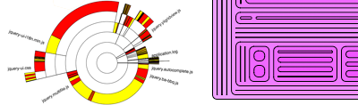

# p5.treevis


## Live examples
  + [Testbed with several examples in one large canvas](https://oth-aw.github.io/treevis/)
  + [Basic Sunburst example](https://oth-aw.github.io/treevis/examples/ /index_sunburst.html)
  + [Basic Treemap example](https://oth-aw.github.io/treevis/examples/)
  + [Treemap example without canvas](https://oth-aw.github.io/treevis/examples/index_div.html)
  
 
## installation
Just include the scripts.
```html
  <script src="addons/p5.dom.min.js"></script>
  <script src="addons/p5.treevis.js"></script>
```

## Basic usage
This is a complete example for displaying and drawing with interaction
Please look in the source code of examples to see how to customize.
Or look in the well documented source files in the src folder.

```javascript
var treevis, data;

function preload() {
  // Loads json tree
  data = loadJSON("data/example_scan.json");
}

function setup() {
  createCanvas(800, 600);
  // Description of json properties
  // 'children' is an array with child objects
  // 'name' is identifier
  // 'size' is content value
  var properties = {
      children: "children",
      label: "name",
      value: "size"
  };
  // creates a new Sunburst object
  treevis = createSunburst(data, properties);
  //callback function
  treevis.onSelected((v, name) => console.log("Selected: "+name));
}

function draw() {
  background(255);
  // draws sunburst
  treevis.draw();
}

function mouseClicked() {
  if (mouseButton == RIGHT) {
    // navigate out
    treevis.up();
  } else {
    // navigate in
    treevis.select(mouseX, mouseY);
  }
}
```
## p5.treevis doc

#### createTreemap()
###### treemap = createTreemap(json_data, props)
Creates a new treemap visualisation

```javascript
// Rounds corners
treemap.setCorner(5);
// Makes inset
treemap.setInset(5);
```
#### createSunburst()
###### sunburst = createSunburst(json_data, props)
Creates a new sunburst visualisation
```javascript
// Sets a different angle and draws a full circle
sunburst.setAngle(90, 360);
```
this works on both treemaps and sundbursts

```javascript
// callback function
treevis.onSelected((v, name) => console.log("Selected: "+name));
// Sets size and position
treevis.setBounds(100,100,400,400);
// Customize fill
treemap.onFill((level, maxLevel) => fill(color(237, (255 - level / maxLevel * 255) * 2 / 3, 255)));
```
